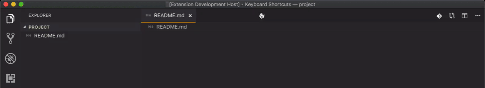

# Collapse Then Reveal for Visual Studio Code
`collapse-then-reveal` is a Visual Studio Code extension to keep your workspace neat and tidy. Every time your active file changes, it collapses the Explorer and focuses the tree directly on what you're doing. Comme ça:

